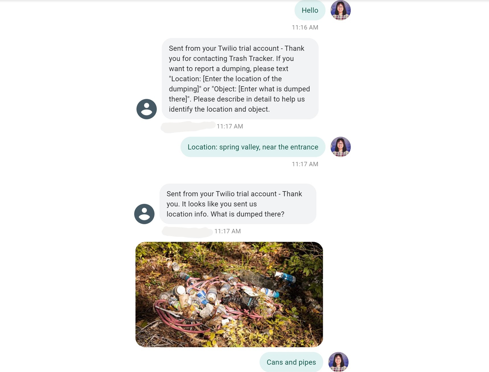
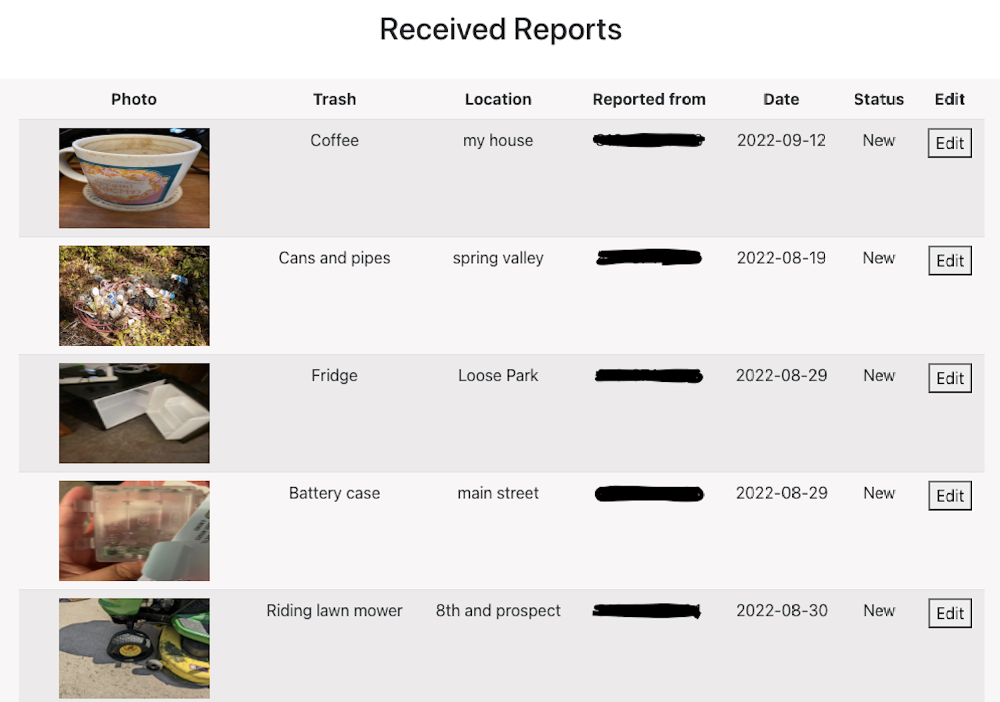

# Trash Tracker Website

[](https://opensource.org/licenses/MIT)

## Description

The Kansas City region has an ugly trash problem. All across the city, especially in the most economically disadvantaged neighborhoods, people dump trash, tires, furniture, and well, anything, in alleys, vacant lots, and even parks and public spaces. In Kansas City, MO alone, illegal dumping costs the city over $2 million each year, and it takes the city an average of three weeks to respond to a dumping report. 

Trash Tracker is a simple, lightweight system that allows residents and staff of the Lykins neighborhood to report illegal dumping with a simple text message and allows admin to view reports and search trash locations so that they can arrange staff and volunteers to clean up the trash.

Project overview documentation: https://drive.google.com/drive/u/1/folders/14qqiA9uD3zp39l-9RSnm3Br4Vc3_R6gQ

## Prerequisites
* Install [Node](https://nodejs.org/en/download/) 
* Install [Amplify Cli](https://docs.amplify.aws/cli/start/install/)

## Local Development
1. Install dependencies

    ```bash
    npm i
    amplify pull dwxknbxpetkwo
    ```

2. Start the app

    ```bash
    npm start
    ```

## Deployment

Text 816-608-6096 to report an illegal trash dumping in the Lykins neighborhood.



Click on [this link](https://main.dwxknbxpetkwo.amplifyapp.com/) or copy and paste the url to your browser to see the website: https://main.dwxknbxpetkwo.amplifyapp.com/. 

If you don't have an account, please create an account to access.



## Troubleshooting 
- Missing aws-export.js (tip: try amplify init, check out [this guide](https://dzone.com/articles/a-complete-guide-for-integrating-aws-amplify-to-re))

## License

[MIT](https://opensource.org/licenses/MIT)

